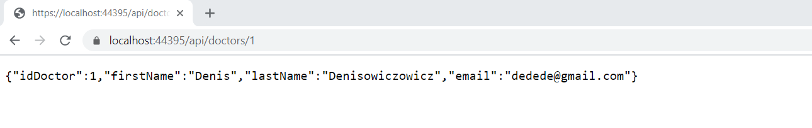
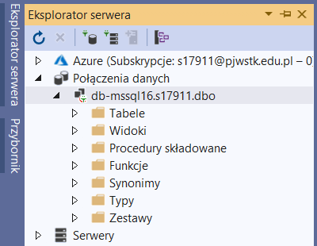
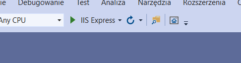

## Przykład działania

Przykład odpowiedzi na dane zapytanie GET.

## Uruchomienie

	1. Otwórz wybrany folder w VisualStudio
	2. Podepnij bazę danych mssql 
	3. Uruchom VS 
	4. W przeglądarce napisz https://localhost:44395/api/doctors/1
	5. Używając aplikacji np. POSTMAN możesz przesłać JSON-a i operować na bazie danych